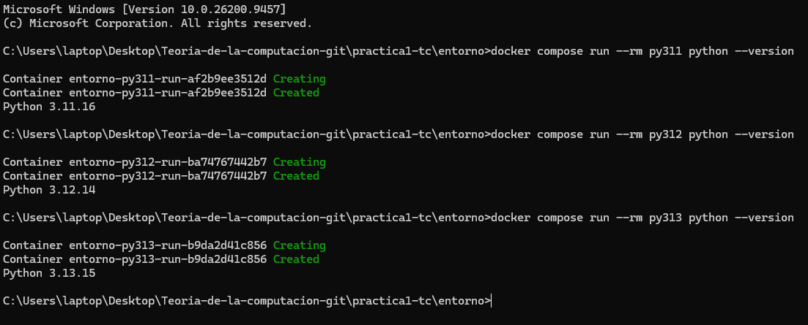
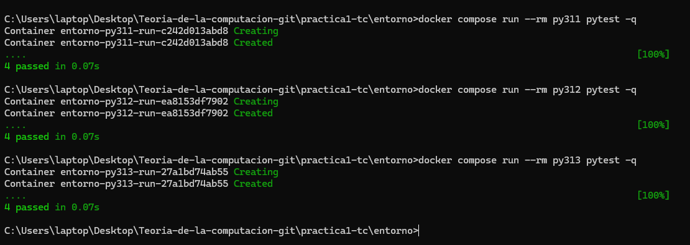
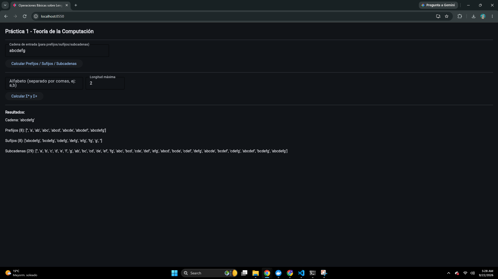

## 1. Justificación de las Versiones de Python
* **Python 3.11 (`py311`)**: Versión base requerida por la biblioteca Flet 0.86.5 que se encuentra en fase activa de soporte.
* **Python 3.12 (`py312`)**: Versión de referencia estándar para la asignatura y servicio asignado para levantar la interfaz web en el puerto 8550.
* **Python 3.13 (`py313`)**: Última versión para validar la compatibilidad futura del código y asegurar que no haya dependencias obsoletas.

## 2. Explicación de la Configuración Docker
* **Parametrización con `ARG`**: Permite reutilizar un único `Dockerfile` pasando la versión deseada (`3.11`, `3.12`, `3.13`) al momento de construir.
* **Entornos virtuales aislados**: La creación de `/opt/venv` fuera de `/app` evita la sobreescritura de dependencias al montar volúmenes.
* **Variables de Flet**: Configuración de `FLET_FORCE_WEB_SERVER=true` y `FLET_SERVER_PORT=8550` para servir la interfaz gráfica como aplicación web sin depender de X11.

## 3. Evidencias de Ejecución
### Verificación de Versiones

### Pruebas Unitarias con Pytest

### Despliegue de la Interfaz Web (Flet)

## 4. Referencias
* Flet Developers. (2026). *Flet Web Publishing Requirements and Deployment Guides*. https://flet.dev/docs/
* Python Software Foundation. (2026). *Python Developer's Guide: Status of Python Versions*. https://devguide.python.org/versions/